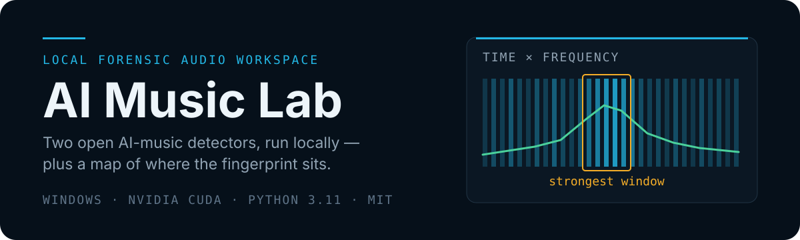
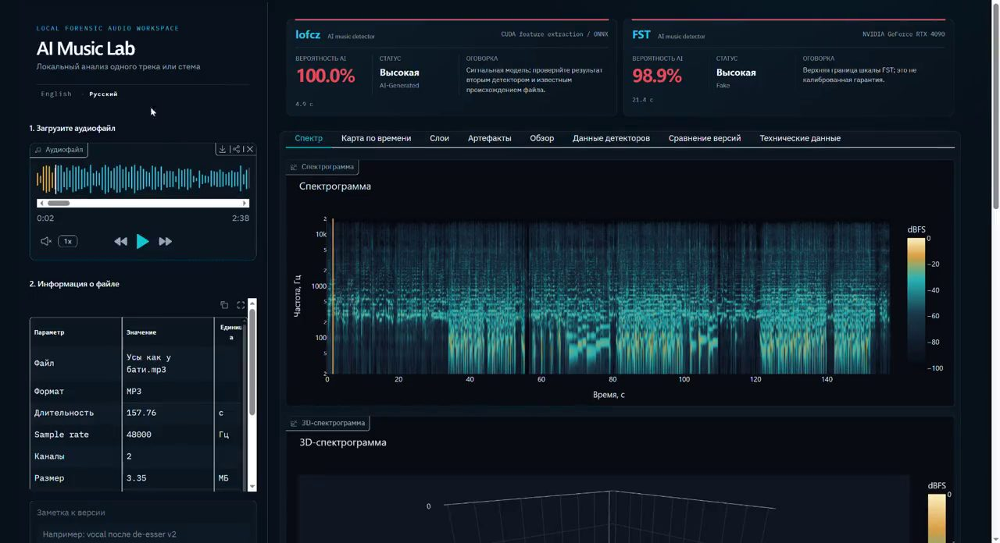
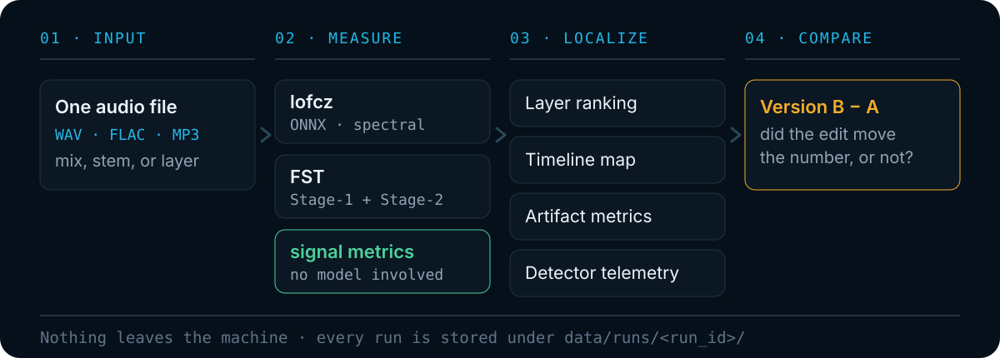

<p align="right"><b>English</b> · <a href="README.ru.md">Русский</a></p>

<p align="center">
  
</p>

<p align="center">
  
  
  
  
  
</p>

You finished a track, and something about it still sounds *generated* — but a single
percentage from a detector will not tell you which part. **AI Music Lab** runs two open
AI-music detectors on your own machine and adds what they are missing: a map of **where**
the fingerprint sits, and an A/B history that shows whether your edit actually moved the
number.

Drop in a mix, a stem, or a single layer. Get a score from each detector, a ranking of which
layers carry the most, a timeline of which seconds are strongest, and signal measurements
that stay meaningful even when the two models disagree.

<p align="center">
  <video src="./assets/readme/demo.mp4" poster="./assets/readme/demo-poster.jpg"
         controls preload="metadata" width="100%">
    <a href="./assets/readme/demo.mp4"></a>
  </video>
</p>

<p align="center"><sub>
  30 seconds of a real run, no sound: one MP3 in, both detectors agreeing, spectrogram and
  native telemetry. <a href="./assets/readme/demo.mp4">Open the video</a> if it does not play here.
</sub></p>

## How it works

Two detectors and one set of model-free signal metrics measure the file. Four views turn
those measurements into something you can act on. Every run is written to disk, so any two
runs of the same source can be compared later.

<p align="center">
  
</p>

The part that makes this more than a wrapper is stage 3. `lofcz` and `FST` each return one
number for a whole track, which is useless as production feedback. Splitting the same track
by **layer** (drums 97%, live guitar 15%) and by **time window** tells you what to re-record
first. The **artifact metrics** — attack sharpness, 95% rolloff, high-frequency slope, noise
floor, channel correlation — are computed straight from the signal with no model involved,
so they keep working when a detector goes outside its training domain.

## Quick start

Windows with an NVIDIA GPU, [Conda](https://docs.conda.io/projects/miniconda/), and Git.

### How the pieces fit together

This repository contains no detector code. Both detectors are cloned **next to** it and left
completely untouched:

```text
<parent>/
├── ai-music-lab/            ← this repository: UI, adapters, history
├── ai-music-detector/       ← lofcz upstream, pinned at 6ba389e
└── FST-AI-Music-Detection/  ← FST upstream, pinned at b564f8b
```

Keeping them as separate, unmodified clones is deliberate. A measurement is only reproducible
if you can say exactly which detector code produced it, and a patched upstream silently
invalidates every score you saved before the patch. It also means you can update either
detector on its own, or check what upstream actually does, without untangling it from wrapper
code.

Three Conda environments, all Python 3.11, because the two detectors pin incompatible
dependency sets:

| Environment | Used for |
| --- | --- |
| `ai-music-ui` | The interface and everything model-free |
| `ai-music-lofcz` | The lofcz detector |
| `ai-music-fst` | The FST detector |

Model weights are **not** in Git. They go into `models/`, downloaded from their official
sources:

| File | Source | Automatable? |
| --- | --- | --- |
| `models/lofcz/ai_music_detector.onnx` | Hugging Face | yes, direct URL |
| `models/fst/Stage-1.ckpt` | Google Drive | no — download manually |
| `models/fst/Stage-2.ckpt` | Google Drive | no — download manually |

Every file has a published SHA-256 in **[Models](docs/models.md)**. Verify before you trust
any measurement made with it.

### Install

```powershell
git clone https://github.com/bionicle12/ai-music-lab.git
git clone https://github.com/lofcz/ai-music-detector.git
git clone https://github.com/Mippia/FST-AI-Music-Detection.git

cd ai-music-lab
conda create -n ai-music-ui python=3.11 -y
conda run -n ai-music-ui python -m pip install -r environments\ai-music-ui.txt
```

Then create the two detector environments, download the three model files, and start it:

```powershell
.\start_ui.ps1
```

Open `http://127.0.0.1:7860`, drop in an audio file, pick the detectors, and press
**Run analysis**. The full step-by-step, including pinning the upstream commits and the
smoke tests, is in **[Getting started](docs/getting-started.md)**.

> **Prefer to delegate it?** **[Setting up with an AI agent](docs/agent-setup.md)** has
> copy-paste prompts that walk a coding agent through the whole installation, plus prompts for
> diagnosing a broken install and updating upstream safely.

> **Languages.** The interface is served in English at `/` and in Russian at `/ru`. The
> switcher sits under the title and your choice is remembered in the browser.

## Documentation

| Page | What it covers |
| --- | --- |
| [Getting started](docs/getting-started.md) | Environments, models, first run, troubleshooting |
| [AI agent setup](docs/agent-setup.md) | Copy-paste prompts to install, diagnose and update |
| [Models](docs/models.md) | Official download sources, sizes, verified SHA-256 |
| [Analysis](docs/analysis.md) | The single-file run: spectrum, 3D surface, player sync |
| [Layers](docs/layers.md) | Ranking stems to find what to re-record first |
| [Timeline map](docs/timeline.md) | Sliding-window localization inside one track |
| [Artifact metrics](docs/artifact-metrics.md) | Model-free measurements straight from the signal |
| [A/B comparison](docs/comparison.md) | Pinning version A and measuring what an edit changed |
| [Detector data](docs/detector-data.md) | Native telemetry from lofcz and FST |
| [Command line](docs/cli.md) | Running the adapters without the UI, smoke tests |
| [Limitations](docs/limitations.md) | What the numbers do and do not mean — read this one |
| [A few honest words](docs/about.md) | Why this exists, and what it is not for |

## What this is not

A detector score is a measurement tied to a version of code, weights, an input file and the
conditions of the run. **It is not proof of where a track came from**, and this project will
not tell you otherwise.

- Compare like with like. MP3 rolls off high frequencies on its own, so MP3 against WAV shows
  the codec, not the generator.
- `FST` needs detectable beats. On vocals or ambience it returns a clear "not applicable"
  rather than a fake number.
- The timeline map is a *relative* map inside one track, not a calibrated per-second
  probability.
- A low score from one model and a high score from the other is a real disagreement worth
  keeping, not a bug to average away.

The full reasoning is in **[Limitations](docs/limitations.md)**.

And no, this is not a tool for fooling detectors — I wrote down why, along with how the
project came about, in **[A few honest words](docs/about.md)**.

## Built on

This repository is a wrapper. It does not modify, vendor or redistribute either detector —
both are cloned separately and pinned to a known commit.

| Upstream | Pinned commit | License |
| --- | --- | --- |
| [lofcz/ai-music-detector](https://github.com/lofcz/ai-music-detector) | `6ba389e` | MIT |
| [Mippia/FST-AI-Music-Detection](https://github.com/Mippia/FST-AI-Music-Detection) | `b564f8b` | none declared upstream |

## Platform

Built and used on Windows with a single RTX 4090. Commands, paths and scripts are
PowerShell- and Conda-native, and **cross-platform support is not planned** — there is only
one machine with a GPU behind this project. Everything runs locally; no audio is uploaded
anywhere.

## License

[MIT](LICENSE) © 2026 Miroslav. The wrapper is MIT; the upstream detectors and their model
weights keep their own terms.

<p align="center">from Russia with ❤️</p>
