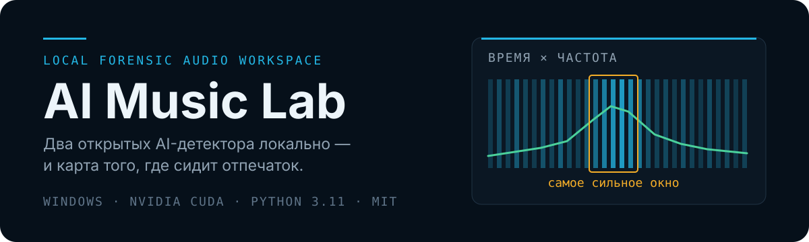
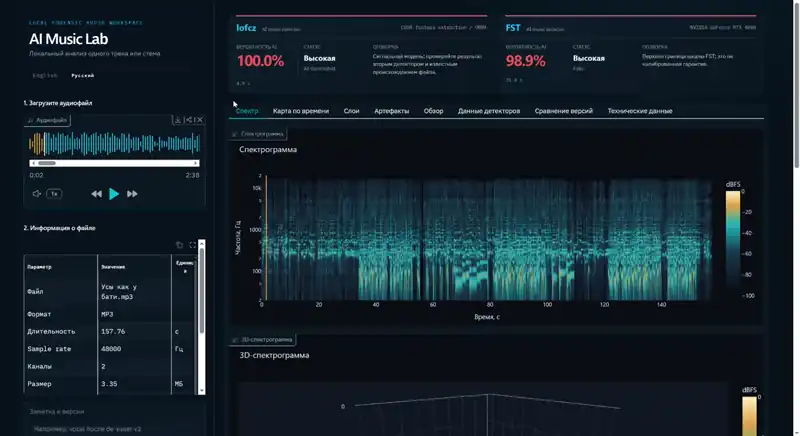
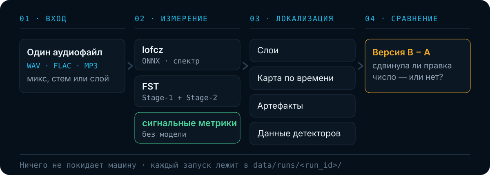

<p align="right"><a href="README.md">English</a> · <b>Русский</b></p>

<p align="center">
  
</p>

<p align="center">
  
  
  
  
  
</p>

Трек готов, но что-то в нём всё ещё звучит *сгенерированно* — а один процент от детектора не
скажет, какая именно часть. **AI Music Lab** запускает два открытых AI-детектора на вашей
машине и добавляет то, чего им не хватает: карту, **где** сидит отпечаток, и A/B-историю,
которая показывает, сдвинула ли правка число на самом деле.

Загружаете микс, стем или отдельный слой. Получаете score от каждого детектора, ранжирование
слоёв по вкладу, карту самых «горячих» секунд и сигнальные измерения, которые остаются
осмысленными, даже когда две модели расходятся.

<p align="center">
  <a href="https://github.com/bionicle12/ai-music-lab/raw/refs/heads/main/assets/readme/demo.mp4">
    
  </a>
</p>

<p align="center"><sub>
  Зацикленное превью первых 12 секунд ·
  ▶ <a href="https://github.com/bionicle12/ai-music-lab/raw/refs/heads/main/assets/readme/demo.mp4"><b>полный прогон 30 секунд (MP4, 1.8 МБ)</b></a>
</sub></p>

## Как это работает

Файл измеряют два детектора и набор сигнальных метрик, не использующих модель. Четыре
представления превращают измерения в то, с чем можно работать. Каждый запуск пишется на диск,
поэтому любые два запуска одного исходника потом можно сравнить.

<p align="center">
  
</p>

Обёрткой это перестаёт быть на третьем этапе. `lofcz` и `FST` возвращают по одному числу на
весь трек, и как продакшн-фидбэк это бесполезно. Разбивка того же трека **по слоям**
(барабаны 97%, живая гитара 15%) и **по временным окнам** показывает, что перезаписывать в
первую очередь. **Артефактные метрики** — резкость атаки, rolloff 95%, спад выше 4 кГц, шумовой
пол, корреляция каналов — считаются прямо из сигнала, без участия модели, поэтому продолжают
работать, когда детектор выходит за пределы своего обучающего домена.

## Чего это стоит по железу

Все цифры ниже сняты на той машине, где проект и делался — Windows, RTX 4090 (24 ГБ),
CUDA 12.8, — семплированием общей памяти видеокарты, пока работал один адаптер и больше ничего.
Тестовый файл: стерео 44,1 кГц длиной 3:26.

| Этап | Память GPU | Время | Растёт с длиной трека? |
| --- | ---: | ---: | --- |
| Интерфейс, графики, артефактные метрики | не нужна — только CPU | секунды | только время |
| lofcz | 0,5 ГБ | 8 с | почти нет |
| FST | 4,8 ГБ (16 ГБ как в апстриме) | 21 с | **ни память, ни время** |
| muscriptor `large` | 11 ГБ | 50 с на 30 с аудио | только время |
| muscriptor `medium` / `small` | не замерял | — | — |

Две строки требуют пояснения — обе устроены не так, как кажется.

**FST безразлична длина трека.** Он всегда обрабатывает 48 десятисекундных сегментов: короткий
файл дополняется до 48, а не считается меньшим их числом. Файл на 32 секунды и файл на восемь
минут стоят одинаково — это замер, а не оценка.

И 16 ГБ, которые просит апстрим, ему тоже не нужны. Все 48 сегментов идут через backbone одним
проходом, но до классификатора Stage-2 они независимы, поэтому адаптер подаёт их восьмёрками:
**4,8 ГБ вместо 16 за то же время** — вычислениями карта не была занята никогда.
`--backbone-batch 0` возвращает ровно апстримное поведение.

Это изменение в том, как запускается опубликованная модель, поэтому оно замерено, а не принято на
веру. Из трёх треков два дали одинаковый выход, третий сдвинул сырой логит на
один ulp float16 (`6.0546875` → `6.05859375`) при неизменных предсказании и всех выводимых
вероятностях. Каждый размер батча воспроизводит сам себя точно — три прогона, одно значение, —
значит дело в порядке суммирования, а не в случайности. Размер батча записывается в телеметрию
запуска: оценка обязана уметь сказать, чем она получена.

**muscriptor тратит длину на время, а не на память.** Он расшифровывает пятисекундными кусками,
поэтому трёхминутный трек — это около сорока кусков: рассчитывайте на минуты, не на секунды.
`large` — это 1,4 млрд параметров в fp32. `medium` и `small` существуют как раз для карт
поменьше, их загрузки весят 1,2 ГБ и 0,4 ГБ против 5,6 ГБ, но замерял я только `large` и не буду
публиковать число, которого не снимал.

То есть потолок теперь задаёт транскрипция, а не детекция: **8 ГБ видеопамяти хватает на все
детекторы**, а 12 ГБ добавляют к ним экспорт в MIDI на `large`.

Диск: ~1,4 ГБ на две контрольные точки детекторов, ~0,6 ГБ на эмбеддинги MERT, которые FST тянет
при первом запуске, и 0,4–5,6 ГБ на те веса транскрипции, что вы скачаете. Кэш транскрипции
уводится в `models/muscriptor-cache/`, чтобы гигабайты не оседали на системном диске.

Оперативная память на Windows узким местом не является: сам интерфейс занимает около 0,3 ГБ, а
веса живут на видеокарте. Узким местом она становится на Apple Silicon, где память общая, — об
этом в разделе «Платформа».

## Быстрый старт

Детекторы работают под Windows/NVIDIA через Conda и под Apple Silicon macOS в локальных venv.
FST использует CUDA на Windows и поэтапный CPU→MPS тракт на Mac.

### Как всё устроено

В этом репозитории нет ни кода детекторов, ни кода транскрипции. Каждый апстрим клонируется
**рядом** с ним и остаётся полностью нетронутым:

```text
<родительская папка>/
├── ai-music-lab/            ← этот репозиторий: UI, адаптеры, история
├── ai-music-detector/       ← upstream lofcz, зафиксирован на 6ba389e
├── FST-AI-Music-Detection/  ← upstream FST, зафиксирован на b564f8b
└── muscriptor/              ← аудио → MIDI, следит за main (необязателен)
```

Держать их отдельными неизменёнными клонами — сознательное решение. Измерение воспроизводимо
только если можно точно сказать, какой код детектора его дал, а пропатченный upstream молча
обесценивает все score, сохранённые до правки. Плюс так можно обновлять любой детектор
отдельно или посмотреть, что upstream реально делает, не распутывая его с кодом обёртки.

Три Conda-среды, все на Python 3.11, потому что детекторы фиксируют несовместимые наборы
зависимостей:

| Среда | Для чего |
| --- | --- |
| `ai-music-ui` | Интерфейс и всё, что считается без моделей |
| `ai-music-lofcz` | Детектор lofcz |
| `ai-music-fst` | Детектор FST |

Весов моделей в Git **нет**. Они кладутся в `models/` и скачиваются из официальных источников:

| Файл | Источник | Автоматизируется? |
| --- | --- | --- |
| `models/lofcz/ai_music_detector.onnx` | Hugging Face | да, прямая ссылка |
| `models/fst/Stage-1.ckpt` | Google Drive | нет — скачивать вручную |
| `models/fst/Stage-2.ckpt` | Google Drive | нет — скачивать вручную |

У каждого файла есть опубликованный SHA-256 в **[Моделях](docs/ru/models.md)**. Проверяйте
до того, как доверять сделанным на них измерениям.

### Установка

На Apple Silicon с Homebrew Python 3.11:

```bash
chmod +x bootstrap_macos.sh start_ui.sh
./bootstrap_macos.sh
./start_ui.sh
```

Bootstrap создаёт `.venv-ui`, `.venv-lofcz` и `.venv-fst`, готовит зафиксированные клоны,
проверяет native MPS, скачивает lofcz и сверяет хэши двух вручную скачанных FST checkpoint.
Пути и измерения памяти — в [Начале работы](docs/ru/getting-started.md). muscriptor остаётся
отдельным следующим этапом для macOS.

На Windows:

```powershell
git clone https://github.com/bionicle12/ai-music-lab.git
git clone https://github.com/lofcz/ai-music-detector.git
git clone https://github.com/Mippia/FST-AI-Music-Detection.git

cd ai-music-lab
conda create -n ai-music-ui python=3.11 -y
conda run -n ai-music-ui python -m pip install -r environments\ai-music-ui.txt
```

Затем создайте две среды детекторов, скачайте три файла моделей и запускайте:

```powershell
.\start_ui.ps1
```

Откройте `http://127.0.0.1:7860/ru`, загрузите аудиофайл, выберите детекторы и нажмите
**Запустить анализ**. Полная пошаговая инструкция, включая фиксацию коммитов upstream и
smoke-тесты, — в **[Начале работы](docs/ru/getting-started.md)**.

> **Хотите делегировать?** В **[Установке через ИИ-агента](docs/ru/agent-setup.md)** лежат
> готовые промпты, которые проведут кодового агента через всю установку, плюс промпты для
> диагностики сломанной установки и безопасного обновления upstream.

> **Языки.** Интерфейс отдаётся на английском по адресу `/` и на русском по `/ru`.
> Переключатель — под заголовком, выбор запоминается в браузере.

## Документация

| Страница | О чём |
| --- | --- |
| [Начало работы](docs/ru/getting-started.md) | Среды, модели, первый запуск, типичные проблемы |
| [Установка через ИИ-агента](docs/ru/agent-setup.md) | Готовые промпты: установка, диагностика, обновление |
| [Модели](docs/ru/models.md) | Официальные источники, размеры, проверенные SHA-256 |
| [Анализ](docs/ru/analysis.md) | Обычный запуск: спектр, 3D-поверхность, синхронизация с плеером |
| [Слои](docs/ru/layers.md) | Ранжирование стемов: что перезаписывать первым |
| [Карта по времени](docs/ru/timeline.md) | Локализация скользящим окном внутри трека |
| [Артефактные метрики](docs/ru/artifact-metrics.md) | Измерения прямо из сигнала, без модели |
| [Сравнение A/B](docs/ru/comparison.md) | Как закрепить версию A и измерить, что изменила правка |
| [Данные детекторов](docs/ru/detector-data.md) | Нативная телеметрия lofcz и FST |
| [Аудио → MIDI](docs/ru/midi.md) | Настройка транскрипции: токен, веса и их лицензия |
| [Роадмап редактирования](docs/ru/editing-roadmap.md) | Что должна делать починка сгенерированного стема |
| [Командная строка](docs/ru/cli.md) | Запуск адаптеров без UI, smoke-тесты |
| [Ограничения](docs/ru/limitations.md) | Что числа значат, а что — нет. Эту страницу стоит прочитать |
| [Несколько честных слов](docs/ru/about.md) | Откуда взялся проект и для чего он не предназначен |

## Что дальше

Лаборатория умеет измерить трек и теперь умеет достать из него MIDI. Чего она пока не умеет —
**чинить**, и движется она именно туда.

**SunoFix — починка сгенерированных стемов.** Suno и соседи оставляют узнаваемые повреждения:
размазанные атаки, жёсткий потолок в верхней октаве, артефакты, вылезающие в плотных местах,
стемы, которые на самом деле никогда не были раздельными. План — проход починки, нацеленный на
эти конкретные дефекты в одном стеме, а не общая кнопка «улучшить». И с той же дисциплиной, что
и всё остальное здесь: измерили стем, починили, а сравнение A/B сказало, сдвинулось ли число на
самом деле. Фундамент уже лежит: артефактные метрики выбирались ровно как те измерения, которые
такой проход обязан улучшать. Текущие мысли — **[Роадмап редактирования](docs/ru/editing-roadmap.md)**.

**Больше детекторов на тех же условиях.** Каждый детектор здесь — неизменённый клон upstream,
закреплённый на коммите, поэтому добавить ещё один — это адаптер и среда, а не вендоринг чужого
кода. Две модели, которые расходятся во мнении, уже информативнее одной; четыре будут
информативнее двух.

**Настройка и установка детекторов из интерфейса.** Сделано: у каждого детектора рядом с
чекбоксом есть шестерёнка, открывающая его собственный диалог — может ли он вообще запуститься
(клон, среда, веса, с путями), на каком коммите апстрима стоит, с какими параметрами работает и
кнопка доустановить недостающее. Первый такой параметр — размер батча backbone у FST, а
настройки, с которыми считался запуск, пишутся в файл запуска: сохранённая оценка всегда должна
уметь сказать, чем она получена. Пороги и длины окон пока остаются дефолтами адаптеров.

**macOS.** UI, lofcz, анализ без моделей и FST/MPS реализованы и измерены; следующим этапом
остаётся muscriptor.

## Чем это не является

Оценка детектора — измерение, привязанное к версии кода, весов, входному файлу и условиям
запуска. **Это не доказательство происхождения трека**, и проект не будет утверждать обратное.

- Сравнивать нужно подобное с подобным. MP3 сам по себе режет верх, поэтому MP3 против WAV
  покажет разницу кодека, а не генератора.
- `FST` нужны различимые доли. На вокале или ambience он вернёт понятное «не применимо», а не
  выдуманное число.
- Карта по времени — *относительная* карта внутри одного трека, а не калиброванная вероятность
  на секунду.
- Низкий score одной модели при высоком у другой — это реальное расхождение, которое стоит
  сохранить, а не баг, который надо усреднить.

Полное рассуждение — в **[Ограничениях](docs/ru/limitations.md)**.

И нет, это не инструмент для обмана детекторов — почему именно, а заодно откуда взялся проект,
я написал в **[Нескольких честных словах](docs/ru/about.md)**.

## На чём построено

Этот репозиторий — обёртка. Он не изменяет, не включает в себя и не распространяет ни один
апстрим: каждый клонируется отдельно и фиксируется на известном коммите.

| Upstream | Коммит | Лицензия |
| --- | --- | --- |
| [lofcz/ai-music-detector](https://github.com/lofcz/ai-music-detector) | `6ba389e` | MIT |
| [Mippia/FST-AI-Music-Detection](https://github.com/Mippia/FST-AI-Music-Detection) | `b564f8b` | в upstream не объявлена |
| [muscriptor/muscriptor](https://github.com/muscriptor/muscriptor) | `e2bd0fc` | код MIT · **веса CC BY-NC 4.0** |

Два коммита детекторов — это пины: score сравним между запусками, только пока не двигался код,
который за ним стоит. У muscriptor это версия, против которой проверялась обёртка; он следит за
`main` и может быть перемотан вперёд из панели настроек.

**Веса muscriptor некоммерческие.** Код под MIT, чекпоинты — нет, и карточка модели добавляет
условие сверху: выход нельзя использовать для незаконной деятельности, включая транскрипцию
музыки, прав на которую у вас нет. См. [Аудио → MIDI](docs/ru/midi.md).

## Платформа

Детекторы измерены на Windows с RTX 4090 и на Apple Silicon Mac с 24 ГБ общей памяти. Всё
работает локально, аудио никуда не загружается. На macOS Beat This идёт на CPU, Stage-1 —
ограниченными батчами на MPS, затем освобождается, и Stage-2 тоже запускается на MPS. Default:
доля памяти PyTorch `0.75`, batch `2`. Прогретый 32-секундный smoke занял `15,53 с`, sampled
driver peak — `2 278 309 888` байт (около `2,12 GiB`) при потолке `14 302 248 960` байт.
Batch `4` и `8` на этом коротком fixture тоже прошли, но default не меняют. Глобальный CPU
fallback не включается. muscriptor пока не входит в macOS-bootstrap.

## Лицензия

[MIT](LICENSE) © 2026 Miroslav. Обёртка под MIT.

**У каждого продукта, которого касается эта мастерская, свои условия — читайте их и не
нарушайте законы тем, что здесь делаете.** Upstream-детекторы, веса транскрипции, вложенные
шрифты и любой сэмпл-пак или плагин, который вы принесёте, лицензированы своими авторами, а не
этим репозиторием. Первым подловит muscriptor: код под MIT, а **веса под CC BY-NC 4.0, только
некоммерческое использование**, плюс отдельное условие против транскрипции музыки, прав на
которую у вас нет. Интерфейс говорит об этом там, где это важно; полный список — в таблице выше
и в [docs/models.md](docs/models.md).

<p align="center">from Russia with ❤️</p>
