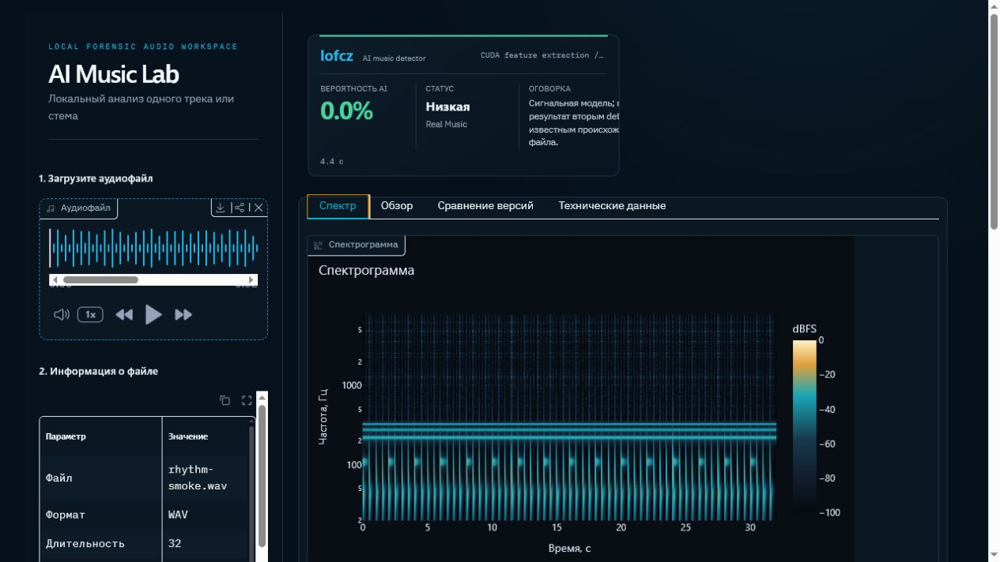
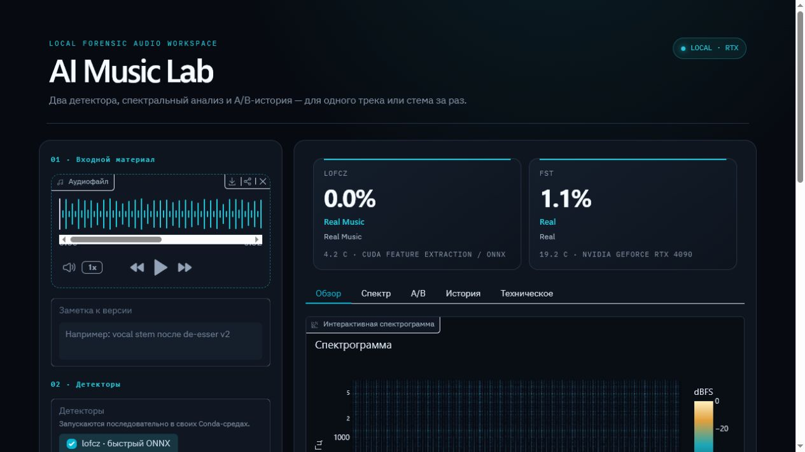

# Analysis

[← Documentation](README.md) · [Русский](ru/analysis.md)

The normal run: one file in, two detector scores plus a set of views describing the signal.

  

## Running one file

The interface takes one WAV, FLAC or MP3 at a time — a full mix, a stem, or a single layer.

1. Drop the file into the upload field.
2. Optionally add a version note, e.g. `vocal stem after de-esser v2`.
3. Select `lofcz`, `FST`, or both.
4. Press **Запустить анализ**.

Detectors run sequentially, each inside its own Conda environment. Every run is written to
`data/runs/<run_id>/` and indexed in `data/history.sqlite3`.

Analysing one file **does not** create a baseline and does not compare it against previous
tracks. Comparison is always explicit — see [A/B comparison](comparison.md).

## Score cards

  

Each detector gets its own card: the probability, a status label, and the runtime with the
device that produced it. Runtime matters more than it looks — it is part of the measurement
conditions, and a run that silently fell back to CPU is not the same measurement as a CUDA run.

Read the two cards as two independent opinions. When they disagree, that disagreement is the
result; see [Limitations](limitations.md#when-the-two-detectors-disagree).

## Tabs

| Tab | What it shows |
| --- | --- |
| **Спектр** (Spectrum) | Interactive spectrogram at `768 × 1536`, plus an isometric 3D surface |
| **Карта по времени** (Timeline) | Sliding-window localization — see [Timeline map](timeline.md) |
| **Слои** (Layers) | Per-stem ranking — see [Layers](layers.md) |
| **Артефакты** (Artifacts) | Model-free measurements — see [Artifact metrics](artifact-metrics.md) |
| **Обзор** (Overview) | RMS dynamics and the average spectrum |
| **Данные детекторов** (Detector data) | Native telemetry — see [Detector data](detector-data.md) |
| **Сравнение версий** (Compare) | Version B − version A — see [A/B comparison](comparison.md) |
| **Технические данные** (Technical) | History, notes, SHA-256, raw detector responses |

## The 3D surface

A cheap `96 × 160` surface is built immediately after the analysis. A separate button rebuilds
it at `256 × 480` without re-running the detectors, because the detectors are the expensive
part and re-running them would also produce a second history entry for the same audio.

## Player synchronization

Every time-axis plot is linked to the audio player in both directions:

- clicking the spectrogram, the RMS dynamics plot or the spectral A/B difference seeks the
  player to that second;
- during playback a vertical position line moves across those same plots.

This runs entirely in the browser ([`music_lab_ui/static/playback_sync.js`](../music_lab_ui/static/playback_sync.js))
with no server round-trip — a request per frame would be far too slow. A plot only joins the
synchronization if it is tagged `layout.meta.time_axis` in `plots.py`, which is why frequency
plots show no position line: there it would point at a meaningless coordinate.

The line updates through `requestAnimationFrame`, capped at roughly 25 fps. Browsers stop
`requestAnimationFrame` entirely in a background tab, so there is a fallback path through the
`timeupdate` event at about 4 updates per second.

## File information

The technical panel records the filename, format, duration and SHA-256 of the input. The hash
is what makes a measurement traceable later: if you cannot prove which file produced a number,
the number is not reproducible.
